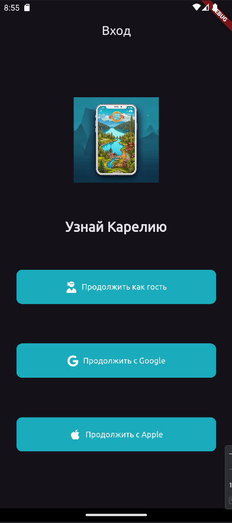
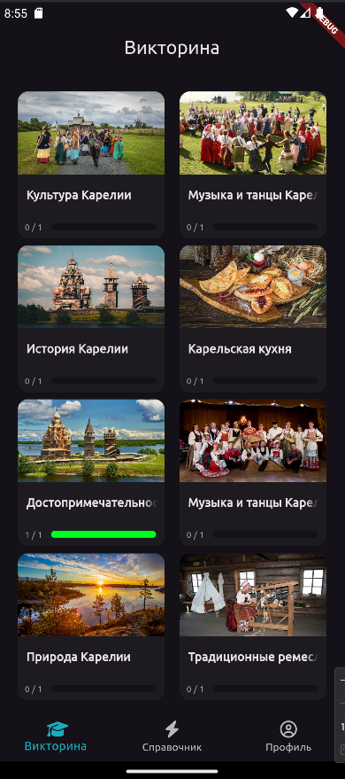
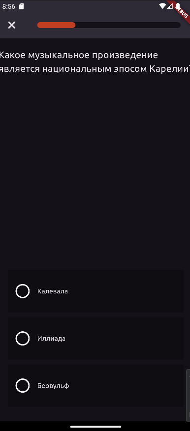
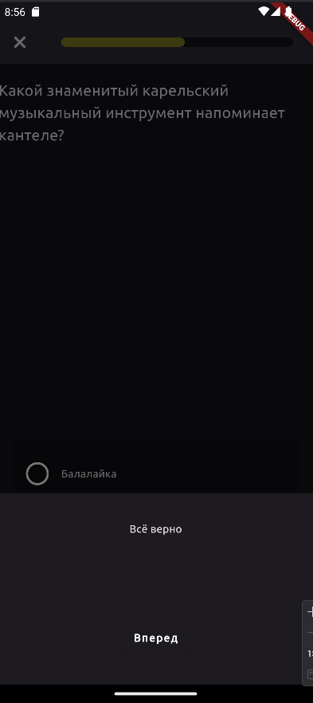
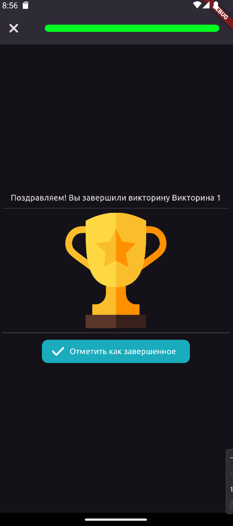
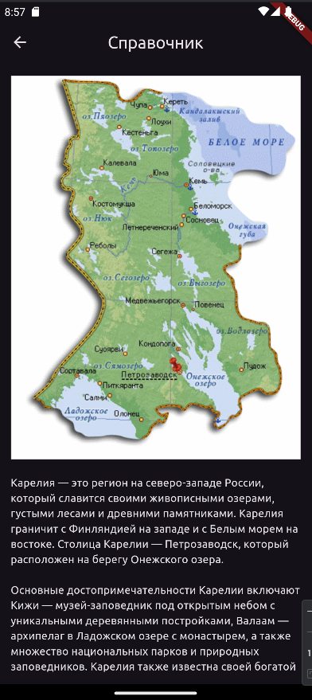

### О репозитории
Отчет по курсу: "Разработка для мобильных ОС"\
Тема: Лабораторная работа 6 (Викторина о Карелии)

Это приложение для мобильных устройств на ОС Android, созданное с использованием Flutter и Firebase. Викторина о Карелии представляет собой интерактивную игру, которая помогает пользователям узнать больше о Карелии через ответы на вопросы.

### Цель приложения:
Приложение разработано для того, чтобы в игровой форме познакомить пользователей с культурой, историей и природными достопримечательностями Карелии.

### Особенности приложения:
1. **Авторизация**: Вход через Google и Apple.
2. **Викторина**: Пользователи могут отвечать на вопросы о Карелии и получать обратную связь о правильности ответов.

### Темы вопросов:
- Изобретения Карелии (Inventions of Karelia)
- Карельская кухня (Karelian Cuisine)
- Достопримечательности Карелии (Landmarks of Karelia)
- Традиционные ремесла Карелии (Traditional Crafts of Karelia)
- История Карелии (History of Karelia)
- Природа Карелии (Nature of Karelia)
- Культура Карелии (Culture of Karelia)
- Праздники Карелии (Festivals of Karelia)
- Туризм в Карелии (Tourism in Karelia)
- Музыка и танцы Карелии (Music and Dance of Karelia)

### Скриншоты приложения:

  
  
  

  
  
  

  
  
  

